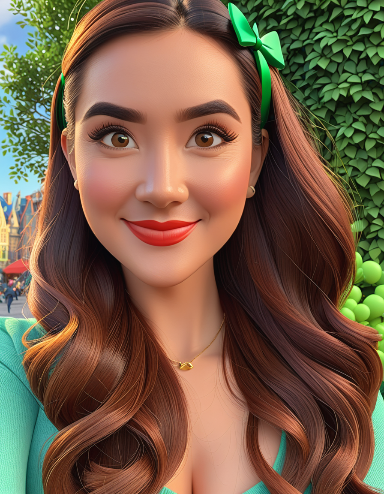

# PixarModelSDXL

<p align="center">
  
  
</p>

## Pixar Style Portrait Generator


This project converts portrait images into Pixar-style images using a deep learning model based on the [SDXL](https://huggingface.co/stabilityai/stable-diffusion-xl-base-1.0) and [Pixar LoRA weights](https://huggingface.co/ntc-ai/SDXL-LoRA-slider.pixar-style). 

### ControlNet
Additionally the [controlnet model](https://github.com/lllyasviel/ControlNet) can be applyed:

1. [**Pose ControlNet:**]() uses [pose estimation](https://huggingface.co/thibaud/controlnet-openpose-sdxl-1.0) to guide the generation process, ensuring that the generated image follows the pose of the input image.

2. [**Canny Edge ControlNet:**](https://huggingface.co/diffusers/controlnet-canny-sdxl-1.0) uses Canny edge detection to guide the generation process, focusing on the edges detected in the input image.

3. [**Scribble ControlNet:**](https://huggingface.co/xinsir/controlnet-scribble-sdxl-1.0) uses a scribble-based approach where the input image is converted into a sketch-like representation to guide the generation process.

4. **No ControlNet:** generates the image without any additional control, purely based on the prompt provided.

### Image description model
For additional image description model you may use the [BLIP](https://huggingface.co/docs/transformers/model_doc/blip) (Bootstrapping Language-Image Pre-training) model. It helps in automatically generating prompts based on the content of the image, enhancing the pixar portrait generation process.

## Dependencies

To run this project, you need the following dependencies:
- Python 3.10 
- pip (Python package installer)
- Docker (optional, for containerized execution)


## Running the project

1. Clone the repository:

```
git clone https://github.com/yourusername/pixar-style-portrait-generator.git
cd PixarModelSDXL
```

2. Install the dependencies:

**Conda env**

First create conda env:
```
conda create -n pixar_editing python==3.10
conda activate pixar_editing
```

Then install all dependencies:

```
pip install -r requirements.txt
conda install pytorch==2.2.0 torchvision==0.17.0 torchaudio==2.2.0 pytorch-cuda=12.1 -c pytorch -c nvidia
```

**Docker**

coming soon.....


3. To run validation pipeline:

```
 accelerate launch pipeline.py --image_path <path to images to process>
```

or you may run gradio app:

```
python app.py
```


## Some examples with different control type


| Uploaded image  | Resulted image | Type of Control | Strength | Guidance Scale |
|--------------------|-----------------|-----------------| ----------|----------------|
|  |  | no control | 0.6 | 8 |
|  |  |  canny | 0.6 | 8 |
|  |  |  scribble | 0.6 | 8 |
|  |   | pose | 0.6 | 8 |